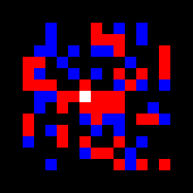
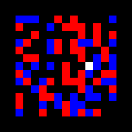
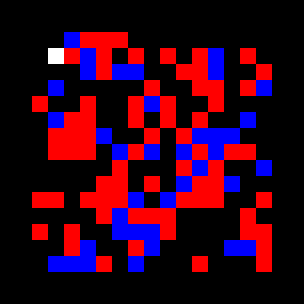

# MVA-DRL
Deep Reinforcement learning project, MVA 2019-2020

Since I ran my notebooks on google colab, I was not able to keep the video on my ipynb file.
That's why i present here an example of game from, trained agents with  a fully connected network, a CNN network and a CNN work in the exploring environment.

Fully connected:

                                 
    
CNN :

Exploration + CNN :

                                    
